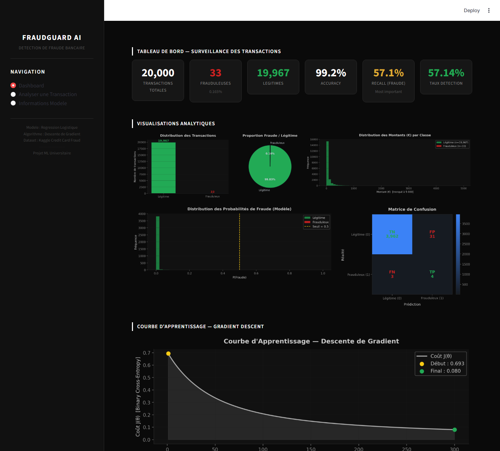
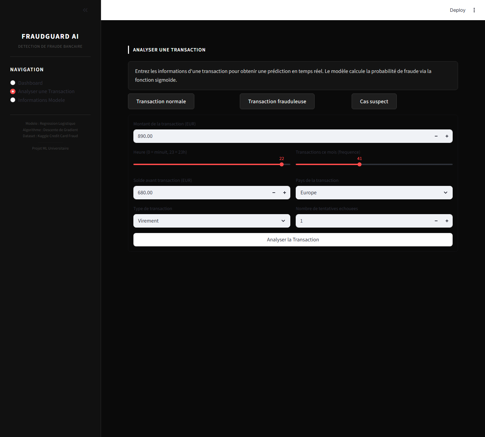
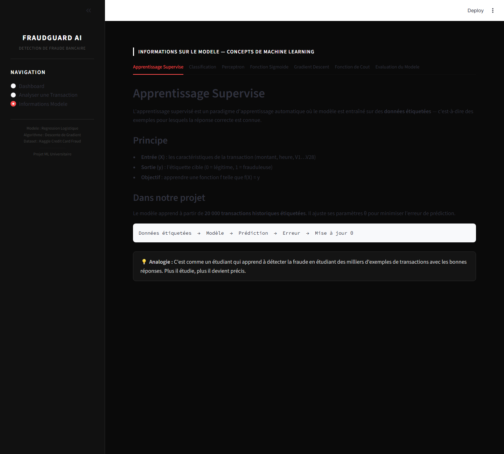

<div align="center">

# 🛡️ FraudGuard AI
### Détection de Fraude Bancaire par Machine Learning

*A complete supervised learning pipeline — from raw data to real-time fraud prediction — built from scratch with Python.*

[](https://www.python.org/)
[](https://streamlit.io/)
[](https://scikit-learn.org/)
[](https://numpy.org/)
[](https://pandas.pydata.org/)
[](https://matplotlib.org/)

</div>

---

## 📸 Interface — Live Screenshots

### Dashboard — Tableau de Bord



> Real-time monitoring: 20,000 transactions analyzed, confusion matrix, sigmoid probability distribution, and the gradient descent learning curve showing cost J(θ) drop from **0.693 → 0.080** over 300 epochs.

---

### Transaction Analyzer — Analyser une Transaction



> Enter any transaction parameters manually or use the preset buttons (Transaction normale / Transaction frauduleuse / Cas suspect) and get an instant fraud probability score from the trained model.

---

### ML Concepts — Informations sur le Modèle



> An interactive educational section covering Supervised Learning, Perceptron architecture, Sigmoid activation, Gradient Descent, Binary Cross-Entropy, and Evaluation metrics — all with embedded LaTeX equations.

---

## 🧠 What This Project Does

FraudGuard AI is an **end-to-end binary classification system** that detects fraudulent bank transactions. It implements two parallel approaches:

| Approach | Purpose | Algorithm |
|---|---|---|
| **Manual Perceptron** (NumPy) | Educational — generates the gradient descent loss curve | Forward pass + Backpropagation by hand |
| **Logistic Regression** (Scikit-Learn) | Production — powers all live predictions in the dashboard | L-BFGS optimization, `class_weight='balanced'` |

Both approaches solve the same mathematical problem: learn a function `f(X) → {0, 1}` that maps 30 transaction features to a binary fraud/legitimate label.

---

## 🤖 The Algorithm — How the Model is Trained

### Step 1 — Data Preprocessing

The raw Kaggle dataset (284,807 rows) is stratified-sampled to **20,000 transactions** to preserve the original fraud ratio while keeping training fast. Then:

```python
# Feature scaling — Amount and Time have different ranges than V1-V28 (PCA)
scaler = StandardScaler()
df["Amount_scaled"] = scaler.fit_transform(df[["Amount"]])
df["Time_scaled"]   = scaler.fit_transform(df[["Time"]])
df.drop(columns=["Amount", "Time"], inplace=True)

# Split: 80% train, 20% test — stratified to preserve fraud ratio
X_train, X_test, y_train, y_test = train_test_split(
    X, y, test_size=0.20, stratify=y, random_state=42
)
# Result: 16,000 training samples | 4,000 test samples
```

**Feature set (30 total):**
- `V1` through `V28` — anonymized PCA components (already scaled in the original dataset)
- `Amount_scaled` — transaction amount normalized with StandardScaler
- `Time_scaled` — seconds since first transaction, normalized

---

### Step 2 — The Perceptron Model (Manual NumPy Implementation)

A single artificial neuron takes the 30 input features and computes:

**Linear combination:**
```
z = w₁x₁ + w₂x₂ + ... + w₃₀x₃₀ + b
  = wᵀX + b
```

**Sigmoid activation** maps z to a probability [0, 1]:
```
σ(z) = 1 / (1 + e^(-z))
ŷ = σ(z)
```

**Decision rule:**
```
if ŷ ≥ 0.5  →  Fraud     (Class = 1)
if ŷ < 0.5  →  Legitimate (Class = 0)
```

The full NumPy implementation from `train_model.py`:

```python
class ManualPerceptron:

    @staticmethod
    def _sigmoid(z):
        # Clipped to avoid overflow in exp(-z) for extreme values
        return 1.0 / (1.0 + np.exp(-np.clip(z, -500, 500)))

    def fit(self, X, y):
        n_samples, n_features = X.shape
        self.weights = np.zeros(n_features)  # Initialize weights at 0
        self.bias    = 0.0

        for epoch in range(self.epochs):
            # --- FORWARD PASS ---
            z     = X @ self.weights + self.bias   # Linear combination
            y_hat = self._sigmoid(z)               # Sigmoid activation

            # --- LOSS: Binary Cross-Entropy ---
            eps  = 1e-9  # Avoid log(0)
            loss = -np.mean(
                y * np.log(y_hat + eps) + (1 - y) * np.log(1 - y_hat + eps)
            )
            self.loss_history.append(loss)

            # --- BACKWARD PASS: Compute gradients ---
            error = y_hat - y                 # Prediction error
            dw    = (X.T @ error) / n_samples # Gradient w.r.t. weights
            db    = np.mean(error)            # Gradient w.r.t. bias

            # --- GRADIENT DESCENT UPDATE ---
            self.weights -= self.lr * dw      # w = w - α · ∂J/∂w
            self.bias    -= self.lr * db      # b = b - α · ∂J/∂b
```

**Hyperparameters used:** `learning_rate α = 0.05`, `epochs = 300`

---

### Step 3 — The Cost Function: Binary Cross-Entropy

To measure how wrong the predictions are, we use **Binary Cross-Entropy (Log Loss)**:

```
J(w, b) = -(1/m) · Σ [ y·log(ŷ) + (1-y)·log(1-ŷ) ]
```

| Situation | Cost |
|---|---|
| y=1 (fraud), ŷ → 1 (correctly predicted) | Cost ≈ 0 — perfect |
| y=1 (fraud), ŷ → 0 (completely missed) | Cost → ∞ — catastrophic |
| y=0 (legit), ŷ → 0 (correctly predicted) | Cost ≈ 0 — perfect |

This function is **convex**, meaning gradient descent always converges to the global minimum. The loss curve on the dashboard proves this — it decreases monotonically from **0.693 to 0.080** across 300 epochs.

---

### Step 4 — Gradient Descent Optimization

Gradient descent iteratively adjusts the weights to minimize J(w, b):

```
Partial derivative w.r.t. weights:
∂J/∂w = (1/m) · Xᵀ · (ŷ - y)

Partial derivative w.r.t. bias:
∂J/∂b = (1/m) · Σ(ŷ - y)

Update rule (one step per epoch):
w ← w - α · ∂J/∂w
b ← b - α · ∂J/∂b
```

The learning rate `α = 0.05` controls the step size. Too large → overshoots the minimum and diverges. Too small → converges correctly but very slowly.

---

### Step 5 — Production Model (Scikit-Learn Logistic Regression)

For live predictions in the dashboard, we use Scikit-Learn's `LogisticRegression` which implements the **L-BFGS** solver (a quasi-Newton second-order optimizer, faster and more accurate than plain gradient descent for this scale):

```python
model = LogisticRegression(
    solver="lbfgs",         # Limited-memory BFGS — efficient second-order optimizer
    max_iter=1000,          # Allow up to 1000 iterations to converge
    class_weight="balanced",# Compensates for the 0.17% fraud / 99.83% legit imbalance
    random_state=42,        # Reproducibility
    C=1.0,                  # Regularization strength (L2 penalty, inverse)
    tol=1e-4,               # Convergence tolerance
)
model.fit(X_train, y_train)
```

> **Note:** Logistic Regression is mathematically identical to a single-neuron Perceptron with sigmoid activation. The difference is only in the optimizer — sklearn uses L-BFGS instead of plain gradient descent for faster convergence.

---

## 📊 Dataset

**Source:** [Kaggle — Credit Card Fraud Detection (ULB)](https://www.kaggle.com/datasets/mlg-ulb/creditcardfraud)

| Property | Value |
|---|---|
| Full dataset size | 284,807 transactions |
| Working sample | 20,000 (stratified) |
| Features | Time, Amount, V1–V28 (PCA anonymized) |
| Target | Class: 0 = Legitimate, 1 = Fraud |
| Fraud rate | 0.17% (492 out of 284,807) |
| Missing values | 0 |
| Duplicates removed | Yes |

### The Class Imbalance Problem

```
Legitimate:  19,967  ████████████████████████████████████████████████████ 99.83%
Fraudulent:      33  ▌                                                     0.17%
```

A naive model that always predicts "Legitimate" would achieve **99.83% accuracy** while detecting **zero fraud**. This is why we do not optimize for accuracy — we optimize for **Recall**.

**Solution applied:** `class_weight='balanced'` in Logistic Regression automatically reweights each class inversely proportional to its frequency:

```
weight_fraud     = n_samples / (2 × n_fraud)     →  much higher penalty
weight_legitimate = n_samples / (2 × n_legitimate) →  normal penalty
```

This forces the model to pay much more attention to getting fraud predictions right.

---

## 📈 Model Performance Results

Evaluated on the **4,000 unseen test transactions** (the 20% held-out split):

| Metric | Result | Notes |
|---|---|---|
| **Accuracy** | 99.2% | High, but misleading due to imbalance |
| **Recall (Fraud)** | 57.14% | 4 out of 7 frauds detected |
| **Taux de Détection** | 57.14% | Same as Recall |
| **True Positives (TP)** | 4 | Frauds correctly caught |
| **True Negatives (TN)** | 3,962 | Legit transactions correctly cleared |
| **False Positives (FP)** | 31 | Legit transactions wrongly flagged |
| **False Negatives (FN)** | 3 | Frauds that slipped through |
| **Loss curve start** | J = 0.693 | Maximum entropy (random model) |
| **Loss curve final** | J = 0.080 | After 300 epochs of gradient descent |

### Why Recall is the Only Metric That Matters

```
Recall = TP / (TP + FN)
```

A **False Negative (FN)** = a fraud the model did not catch = real money stolen from a real customer. The bank loses the full transaction amount, faces legal liability, and damages customer trust.

A **False Positive (FP)** = a legitimate transaction incorrectly flagged = a brief inconvenience (declined card), easily resolved with a phone call.

**Conclusion:** In any fraud detection system, missing a fraud is infinitely more costly than triggering a false alarm. We always prioritize maximizing Recall.

---

## 🗂️ Project Structure

```
ML project/
│
├── assets/                         Real screenshots of the running application
│   ├── dashboard.png               Dashboard page (metrics + charts)
│   ├── analyze.png                 Transaction analyzer page
│   ├── model_info.png              ML concepts educational page
│   └── dashboard_full.png          Full-scroll dashboard view
│
├── models/                         Serialized trained artifacts (generated by train_model.py)
│   ├── fraud_model.pkl             Trained LogisticRegression (sklearn)
│   ├── scaler.pkl                  StandardScaler fitted on Amount + Time
│   ├── loss_history.npy            300-epoch loss array from ManualPerceptron
│   └── meta.pkl                    X_test, y_test, feature_names
│
├── preprocessing.py                Data loading, cleaning, scaling, train/test split
├── train_model.py                  ManualPerceptron (NumPy) + LogisticRegression (sklearn)
├── evaluation.py                   All metrics: accuracy, recall, F1, AUC-ROC, confusion matrix
├── visualizations.py               All matplotlib dark-mode charts (8 chart types)
├── app.py                          3-page Streamlit dashboard
└── requirements.txt                Python dependencies
```

---

## 🚀 How to Run

### 1. Install dependencies
```bash
pip install -r requirements.txt
```

### 2. Train the model
```bash
python train_model.py
```
This will:
- Load and preprocess the dataset
- Train the manual NumPy Perceptron (generates the loss curve)
- Train the production Logistic Regression model
- Save `fraud_model.pkl`, `scaler.pkl`, `loss_history.npy`, `meta.pkl` to `models/`
- Print accuracy and recall on the test set

### 3. Launch the dashboard
```bash
python -m streamlit run app.py
```

Open your browser at: **http://localhost:8501**

---

## 📚 Libraries Used

| Library | Version | Role |
|---|---|---|
| `pandas` | latest | Dataset loading, cleaning, sampling |
| `numpy` | latest | Manual Perceptron, sigmoid, gradient descent |
| `scikit-learn` | latest | StandardScaler, LogisticRegression, metrics |
| `matplotlib` | latest | All 8 dark-mode visualizations |
| `seaborn` | latest | Heatmap for confusion matrix |
| `streamlit` | latest | Interactive 3-page web dashboard |
| `joblib` | latest | Saving and loading model artifacts |

> No TensorFlow, PyTorch, XGBoost, or any deep learning framework was used. This project strictly follows the academic course content on supervised learning and binary classification.

---

## 🎓 Academic Concept Mapping

| Course Concept | Where It Is Implemented |
|---|---|
| Supervised Learning | `train_model.py` — model learns from 16,000 labelled transactions |
| Binary Classification | Output: `{0 = Légitime, 1 = Frauduleux}` |
| Perceptron (neuron) | `ManualPerceptron` class in `train_model.py` |
| Sigmoid Activation | `_sigmoid(z) = 1 / (1 + exp(-z))` |
| Cost Function | Binary Cross-Entropy J(w,b) in the training loop |
| Gradient Descent | `w -= lr * dw` / `b -= lr * db` — 300 epochs |
| Learning Rate | `α = 0.05` — chosen empirically |
| Train/Test Split | 80% / 20% stratified — `sklearn.model_selection` |
| Standardization | StandardScaler on Amount and Time features |
| Class Imbalance | `class_weight='balanced'` in LogisticRegression |
| Evaluation | Accuracy, Precision, Recall, F1, Log-Loss, AUC-ROC, Confusion Matrix |
| Visualization | Loss curve, confusion matrix heatmap, probability distribution, class distribution |
